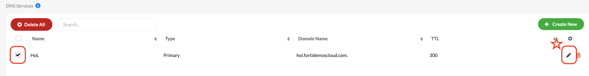

## [FortiDAST](./FortiDAST)

En este laboratorio llevaremos a cabo las siguientes tareas:

- Integración con FortiDAST para llevar a cabo el análisis de vulnerabilidades de nuestro portal web
- Validación de propiedad de la aplicación a escanear
- Comprobación de los resultados del análisis en FortiDAST

## 1. Integración con FortiDAST

- Seleccionamos nuestro portal web desde FortiWeb Cloud
- Accedemos a la sección Vulnerability Scan

- Damos de alta nuestra aplicación para el escaneo

- Seleccionamos la opción Bypass para que el análisis se salte los controles que aplica FortiWeb sobre la aplicación

- El escaneo quedará pendiente de autorización para ser lanzado. Para ello debemos acceder a la configuración del análisis que nos dará acceso a FortiDAST

- En FortiDAST nos aparecerá pre-configurado el análisis para lanzarle a la aplicación donde simplemente tendremos que seleccionar Ok y apuntar el UUID facilitado
 

- En el caso de que la aplicación no aparezca como autorizada tras darla de alta necesitaremos crear una entrada en nuestro servidor DNS (FortiGSLB) para validar el activo a analizar

  
- Para ello accedemos a [FortiGSLB](http://www.fortigslb.com/)
- Seleccionamos la organización HoL

- Seleccionamos "DNS Services" en el menú de la izquierda, donde aparecen las zonas DNS relacionadas con esta organización.

- Seleccionamos la entrada "HoL" y editala para añadir una nueva entrada, bóton lapiz que encontrarás a la derecha. 

- En la parte inferior de la entrada, tras los parámetros de definición de la misma, encontrarás el menú para crear un nuevo registro de tipo TXT. 

- La entrada TXT corresponde al UUID que nos ofrece FortiDAST cuando damos de alta el escaneo:

> [!WARNING]
> Es un entorno compartido, por favor no modifiques nada que no sea lo indicado en la guía o podrás afectar al resto de usuarios

## 2. Lanzamiento de escáner

- Una vez autorizada la aplicación en FortiWeb Cloud ya tendremos la opción de lanzar el escáner

- Si todo ha ido bien en FortiDAST veremos como el escáner cambia de estado pasando a _In Progress_
- Podremos acceder al escáner e ir viendo su evolución desde la opción _View_
- FortiDAST analizará el número de URLs y tecnologías empleadas en la aplicación para ajustar automáticamente los análisis

- Si accedemos a Scan Results podemos ir viendo la evolución del análisis tanto a nivel general (Summary) como para cada una de las URIs a analizar (Vulnerabilities)

- Podemos ver el detalle de los resultados de cada URI pinchando directamente sobre cada una de ellas:

- En las diferentes vistas podemos ver los diferentes descubrimientos por nivel de criticidad (CVSS), Categoría OWASP o SANS, Tecnologías descubiertas,...
- Una vez concluido el análisis podremos ver el Threat Score que nos asigna la herramienta de forma sencilla

- También es posible generar un completo informe con los resultados en formato PDF
- 

- La integración con FortiWeb facilita dichos resultados directamente sobre la propia interfaz de FortiWeb Cloud tanto a nivel de Threat Score como de acceso directo a los resultados

- Con esto concluye este laboratorio de FortiDAST y con él el workshop de Seguridad para aplicaciones web y API

