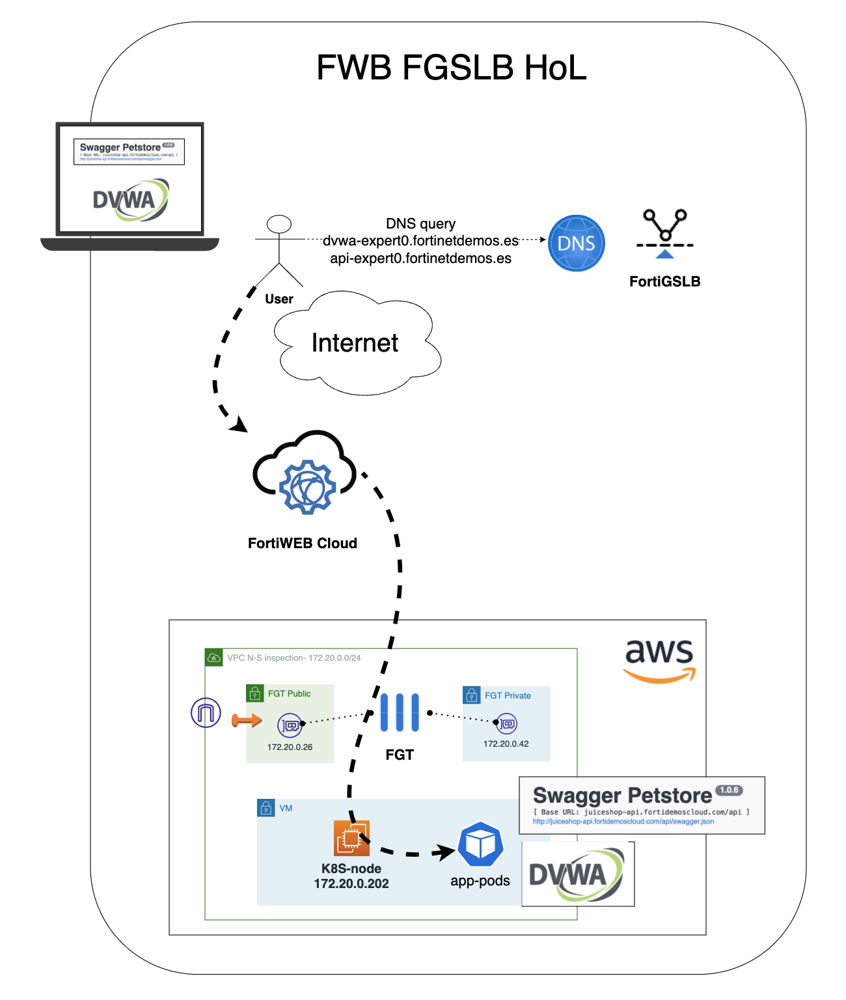

# Hands on Lab Seguridad Aplicaciones Web & API

## Objetivo del laboratorio

El objetivo de este laboratorio es conocer la propuesta de valor de Fortinet para proteger aplicaciones web y APIs a través de sus soluciones de FortiWeb Cloud, FortiDAST y FortiGSLB. Durante el workshop se publicarán 2 aplicaciones de forma segura a través de FortiWeb Cloud simulando un entorno corporativo, con un portal web y una API. En el proceso aprenderás a entrenar el modelo de Machine Learning (ML) de la API para conocer el esquema OpenAPI de la misma y aplicar mecanismos de protección sobre el mismo y también cómo proteger portales web frente a ataques TOP10 OWASP y otros ataques sofisticados.

Al margen de ello podremos comprobar el valor añadido que puede aportar nuestro servicio FortiDAST para evaluar de forma continua la postura de seguridad de nuestras aplicaciones y APIs.

El formato del laboratorio consiste en 2 laboratorios diferenciados cuyos datos de acceso se pueden encontrar en la siguiente URL introduciendo el token que se habrá facilitado previamente a cada asistente por correo electrónico.

- https://workshop.fortinetdemo.es

Una vez dentro del portal para conocer el detalle del entorno de cada usuario se debe consultar el fichero Credenciales_Acceso.xlsx disponible en este enlace y cuya contraseña es la misma que el token facilitado por correo electrónico:

- [Credenciales de acceso](https://drive.google.com/file/d/1mDOx0rxCCXkXzKrHJvAoF-t-Smxg2f-2/view?usp=sharing)

## Indice de laboratorios a completar

* [FortiWeb](./FortiWeb): protección WEB y protección avanzada de APIs
* [FortiDAST](./FortiDAST): análisis de vulnerabilidades de las aplicaciones

## Diagrama general de los laboratorios

A continuación se recoge el diagrama general de los laboratorios disponibles para cada usuario:

- Cada usuario dispone de dos aplicaciones desplegadas en AWS publicadas a través de un FortiGate
- Dicho FortiGate dispone de una VIP para publicar dichas aplicaciones en los puertos 31000 y 31001

## [FortiWeb](./FortiWeb)

En este laboratorio llevaremos a cabo las siguientes tareas:

- Creación de una nueva aplicación en FortiWeb Cloud con origen la aplicación web (DVWA) desplegada para cada usuario 
- Creación de una nueva aplicación en FortiWeb Cloud con origen la API (swagger pet store API) desplegada para cada usuario
- Añadiremos los perfiles de seguridad necesarios para proteger la aplicación Web y la API publicadas
- Creación de los FQDN asociados a cada aplicación para apuntar a la entrada de FortiWeb Cloud correspondiente
- Pruebas de carga contra FortiWeb para que aprenda los patrones de tráfico pueda aplicar protección avanzada no basada en firmas, mediante ML
- Ejercicios de RedTeam para probar la eficacia de la protección

## [FortiDAST](./FortiDAST)

En este laboratorio llevaremos a cabo las siguientes tareas:

- Integración de FortiWeb Cloud con el servicio de análisis de vulnerabilidades de FortiDAST
- Lanzamiento de escaneo sobre las aplicaciones desplegadas para identificar potenciales riesgos de las aplicaciones
- Análisis de los resultados de los escaneos

# Support
This a personal repository with goal of testing and demo Fortinet solutions on the Cloud. No support is provided and must be used by your own responsability. Cloud Providers will charge for this deployments, please take it in count before proceed.

