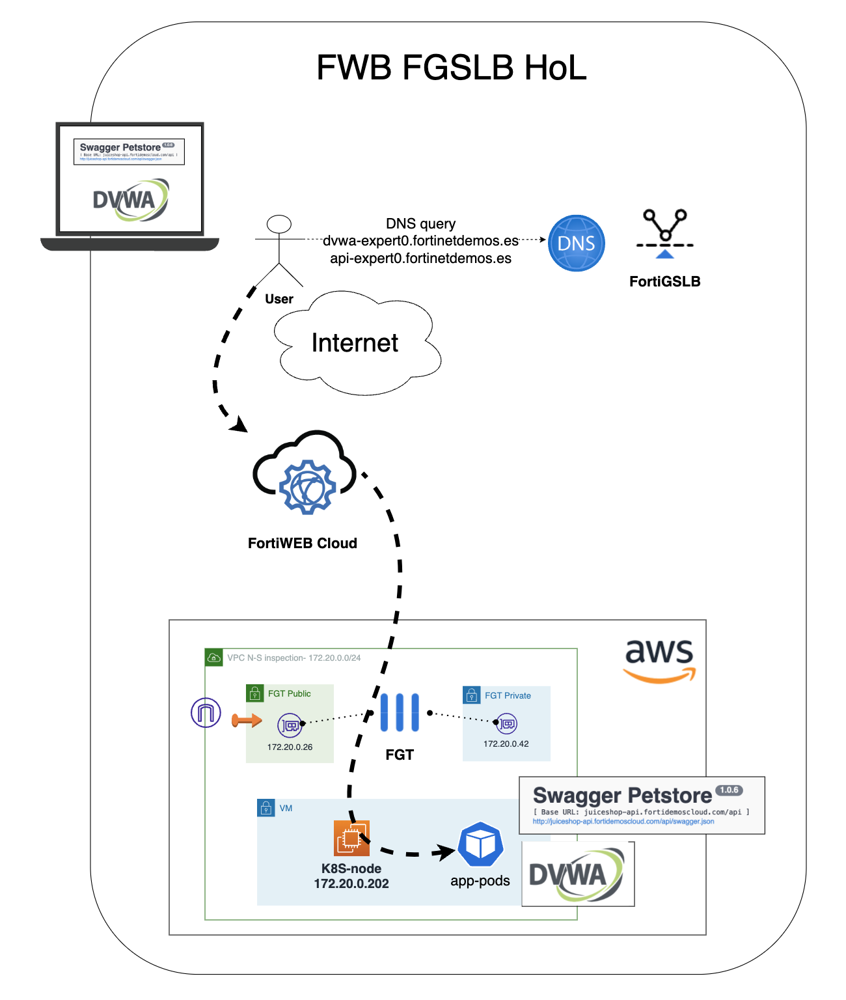

# Hands on Lab FortiWEB Cloud y FortiGSLB
# Protección avanzada de portales WEB y APIs
## Objetivo del laboratorio
El objetivo de este laboratorio es conocer y operar los servicios de Fortinet: FortiWEB Cloud y FortiGSLB. Principalmente nos centraremos en la publicación de 2 aplicaciones de forma segura a través de FortiWEB Cloud, un portal WEB y una API. En el proceso aprenderás a entrenar el modelo de Machine Learning (ML) de la API para conocer el esquema OpenAPI de la misma y a aplicar protección al portal WEB basado reglas TOP10 OWASP y otros ataques sofisticados.

Por último, configuraras nuestro servicio de Global Service Load Balancing (GSLB) mediante DNS, FortiGSLB, para que los usuarios de la aplicación accedan a la misma siempre a su región más cercana. También darás de alta tu aplicación en el servicio DNS, para acceder a la misma de forma sencilla cuando la publiques a través de FortiWEB Cloud. 

El formato del laboratorio consiste en 2 entrenamientos diferenciados y para poder realizarlos encontrarás todos los detalles en la siguiente URL, donde deberás introducir el token facilitado.

https://workshop.fortinetdemo.es

## Indice de laboratorios a completar
* **T1_fortiweb**: protección WEB y protección avanzada de APIs
* T2_fortigslb: añadiremos una entrada DNS para vuestras aplicaciones

## T1: FortiWEB Cloud

En este laboratorio realizaremos lo siguiente:
- Creación de una nueva aplicación en FortiWEB Cloud con origen la aplicación WEB (DVWA) desplegada detrás del tu fortigate de laboratorio. 
- Creación de una nueva aplicación en FortiWEB Cloud con origen la API (swagger pet store API) desplegada detrás del tu fortigate de laboratorio.
- Añadirás los profiles de seguridad necesarios para proteger la aplicación y la API. 
- Lanzaremos pruebas de carga contra FortiWEB para que aprenda los patrones de tráfico de la aplicación y pueda aplicar protección avanzada no basada en firmas, mediante ML.
- Ejercicios de RedTeam para probar la eficacia de la protección.

## Diagrama del laboratorio



# LAB
## Pasos a seguir:

## 1. Conexión al servicio de FortiWEB Cloud
- En el portal de laboratorio, se ha asigando a cada participante una credencial de FortiCloud.


- Con esas credenciales acceder al servicio SaaS de FortiWEB en la url [FortiWEB Cloud](http://www.fortiweb-cloud.com/)


**Recuerda: acceso del tipo IAM login**

## 2. Creación de nuevas aplicaciones
En este punto crearemos las dos aplicaciones a publicar a través de FortiWEB Cloud.

### 2.1. Creación de aplicación portal WEB (DVWA)
- Comprueba que tu aplicación es accesible desde Internet, puedes encontrar la url a la misma en los datos del laboratorio: Acceso a tus aplicaciones > dvwa_url
- La creación de una nueva aplicación en FortiWEB Cloud es bastante sencilla. En este laboratorio realizaremos el alta via GUI en el portal, pero se puede automatizar realizando peticiones a la API del servicio. [FortiWEB Cloud API reference](http://www.fortiweb-cloud.com/apidoc/api.html)
- En el menú de la izquierda seleccionaremos `Global > Applications`


- Dentro de la sección aplicaciones, clicaremos en `ADD APPLICATION` para arrancar el wizard de alta. 


- Wizard step 1: Nombre de applicación y dominio
    * Web Application Name: `user_id`-dvwa (Usuario FortiCloud asignado, ejemplo: fortixpert0-dvwa)
    * Domain Name: `user_id`-dvwa.hol.fortinetdemo.es (ejemplo: fortixpert0-dvwa.hol.fortinetdemo.es)


- Wizard step 2: Protocolo, puertos e IP origen del servidor
    * services allowed: HTTP
    * IP Address: (IP pública de la aplicación, ejemplo: dvwa_url  = http://***15.188.151.180***:31000 )
    * Port: 31000 (Puerto TCP, ejemplo: dvwa_url  = http://15.188.151.180:***31000*** ))
    * Test Server: (comprobar conexión al servidor usando HTTP)

Nota: puedes obtener la IP pública de tu aplicación DVWA en los datos de laboratorio, en la parte de "Acceso a tus aplicaciones > dvwa_url"


- Wizard step 3: CDN
    * services allowed: (NO habilitaremos servicios de CDN)


- Wizard step 4: Habilitar modo bloqueo y template
    * Enable Block mode: ON (habilitamos la protección)
    * Template: `dvwa-hol-template` (selecionamos este template en el desplegable)


- Completado: 
    * El resultado es un nuevo FQDN de nuestra applicación para acceder a través de FortiWEB Cloud y poder actualizar nuestros servidores DNS.
    * Desde el nuevo fqdn podremos acceder a nuestra aplicación a través de FortiWEB Cloud.

Nota: copiar en el nuevo FQDN para utilizar en el punto 4.


- En el menú general de aplicaciones podremos ver cómo FortiWEB Cloud de forma automática ha seleccionado el centro de limpiza de FortiWEB Cloud más cercano a la aplicación y en el mismo Cloud Provider. ([FortiWEB Cloud scrubbing centers](https://docs.fortinet.com/document/fortiweb-cloud/24.2.0/user-guide/847410/restricting-direct-traffic-allowing-fortiweb-cloud-ip-addresses))


FortiWEB Cloud despliega instancias cercanas a la aplicación de manera automática, siendo los principales Datacenters AWS, Azure, GCP y OCI. 

### 2.2. Creación de nuevo CNAME para aplicación DVWA
Para que resulte más sencillo acceder a la nueva aplicación a través de FortiWEB Cloud, vamos a añadir un nuevo CNAME en la zona DNS reservada para el workshop, que resuelva al FQDN proporciando por FortiWEB Cloud para nuestra aplicación. 

- Con el mismo IAM user, puedes acceder al servicio SaaS de FortiGSLB en la url [FortiGSLB](http://www.fortigslb.com/)


**Recuerda: acceso del tipo IAM login**

- Selecciona la organización HoL.


- Selecciona "DNS Services" en el menú de la izquierda, donde aparecen las zonas DNS relacionadas con esta organización.


- Selecciona la entrada "HoL" y editala para añadir una nueva entrada, bóton lapiz que encontrarás a la derecha. 


- En la parte inferior de la entrada, tras los parámetros de definción de la misma, encontrarás el menú para crear un nuevo registro de tipo CNAME. 


- La entrada CNAME corresponde al fqdn que has obtenido al dar de alta la aplicación en FortiWEB Cloud. 
    * Alias: `user_id`-dvwa (ejemplo: fortixpert0-dvwa)
    * Target: `<FortiWEB Cloud FQDN>` (ejemplo: fortixpert0-dvwa.hol.fortinetdemo.es.P911111111.fortiwebcloud.net.)


> [!WARNING]
> Es importante que incluyas un "." al final de la entrada de Target 

- Una vez creada la entrada, ya puedes comprobar como la resolución la nueva entrada, (ejemplo: fortixpert0-dvwa.hol.fortinetdemo.es), apunta al FQDN de la aplicación creada en FortiWEB Cloud. 

> [!TIP]
> Si quieres recuperar la entrada de la aplicación en FortiWEB Cloud, puedes ir al menú "NETWORK > Endpoints". 

### 2.2. Creación de aplicación API (Swagger Pet Store)
- Comprueba que tu aplicación es accesible desde Internet, puedes encontrar la url a la misma en los datos del laboratorio: Acceso a tus aplicaciones > api_url
- La creación de una nueva aplicación en FortiWEB Cloud es bastante sencilla. En este laboratorio realizaremos el alta via GUI en el portal, pero se puede automatizar realizando peticiones a la API del servicio. [FortiWEB Cloud API reference](http://www.fortiweb-cloud.com/apidoc/api.html)

Para dar de alta la aplicación, seguirás los mismos pasos que en el punto anterior. 

***Repetir los mismos pasos que en el punto 2.1***

Cosas que debes tener en cuenta:

- Web Application Name: `user_id`-api (Usuario FortiCloud asignado, ejemplo: fortixpert0-api)
- Domain Name: `user_id`-api.hol.fortinetdemo.es (ejemplo: fortixpert0-api.hol.fortinetdemo.es)

- Template de protección a aplicar en FortiWEB Cloud: ***api-hol-template***

- DNS Alias: `user_id`-api (ejemplo: fortixpert0-api)


## 3. Ejercicios de Red-Team
En este punto empezamos los ejercicios de Red-Team sobre las aplicaciones publicadas. 

## 3.1. Ataques contra la aplicación DVWA

### Injection atacks

Los ataques de inyección ocurren cuando un atacante envía ataques simples basados en texto que explotan la sintaxis del intérprete objetivo. Casi cualquier fuente de datos puede ser un vector de inyección, como variables de entorno, parámetros, servicios web externos e internos, y todo tipo de usuarios. Las fallas de inyección ocurren cuando una aplicación envía datos no confiables a un intérprete. Las fallas de inyección son muy comunes, especialmente en código heredado. A menudo se encuentran en consultas SQL, LDAP, Xpath o NoSQL; comandos del sistema operativo; analizadores XML, encabezados SMTP, argumentos de programa, etc. Las fallas de inyección son fáciles de descubrir al examinar el código, pero más difíciles de descubrir mediante pruebas. Los escáneres y los fuzzers pueden ayudar a los atacantes a encontrar fallas de inyección. La inyección puede provocar pérdida o corrupción de datos, falta de responsabilidad o denegación de acceso. La inyección a veces puede llevar a la toma completa del host. [OWASP A03_2021-Injection] (https://owasp.org/Top10/A03_2021-Injection/)


### 3.1.1 SQL Injection attack (sitio desprotegido)

*** Deshabilita el modo bloqueo en tu aplicación dentro de FortiWeb Cloud si accedes a través de este frontal ***

DVWA tiene un módulo simple utilizado para demostrar ataques de inyección SQL que espera valores de user-id como enteros (por ejemplo, 1, 2, 3). La aplicación mostrará información sobre el usuario asociado con un user-ID dado. En el siguiente ejercicio, inyectaremos comandos SQL para acceder a las contraseñas asociadas con los nombres de usuario.

Accede a tu aplicación DVWA que has dado de alta en FortiWeb Cloud en pasos anteriores: datos de acceso `dvwa_url`


- Introduce el siguiente texto en el campo USER ID: `% 'or '1'='1' -- ';`

> [!NOTE]
> En este escenario, estamos diciendo "mostrar todos los registros que sean falsos y todos los registros que sean verdaderos".
> %’ - Probablemente no será igual a nada y será falso.
> ‘1’=‘1’ - Es igual a verdadero, porque 1 siempre será igual a 1.


- Introduce el siguiente texto en el campo USER ID: `'or '1'='1' union select null, user() #'`


- Usa el siguiente comando para determinar el nombre de la base de datos: `%'or '1'='1' union select null, database() #'`


### 3.1.2 Injection atacks (sitio protegido)

¿Qué pasa si vuelves a lanzar los mismos ataques que en el punto 3.1.1, pero activando el modo bloqueo en FortiWeb Cloud?

### 3.1.3 Command Injection attack (sitio desprotegido)

*** Deshabilita el modo bloqueo en tu aplicación dentro de FortiWeb Cloud si accedes a través de este frontal ***

DVWA tiene un módulo simple utilizado para demostrar ataques de inyección de comandos que espera que un usuario introduzca una dirección IP. La aplicación luego enviará un ping a la dirección IP proporcionada. En el siguiente ejercicio, inyectaremos comandos además de la dirección IP que espera el módulo.

Accede a tu aplicación DVWA que has dado de alta en FortiWeb Cloud en pasos anteriores: datos de acceso `dvwa_url`


- Introduce el siguiente texto que va a permitir ejecutar un comando "pwd" y obtener información sobre el direcotrio donde esta la aplicación desplegada: `4.2.2.2; pwd`


- Pregunta:
    - ¿sería posible ejecutar un comando como “nc” (netcat) y abrir una shell en el sistema?
    - ¿sería posible consultar los metadatos de la instancia que este ejecutando el microservicio y obtener credenciales?

<details>
  <summary>Commandos:</summary>
  127.0.0.1; curl http://169.254.169.254/latest/meta-data/identity-credentials/ec2/security-credentials/ec2-instance
</details>


### 3.1.4 Command Injection attack (sitio protegido)

¿Qué pasa si vuelves a lanzar los mismos ataques que en el punto 3.1.3, pero activando el modo bloqueo en FortiWeb Cloud?

### Cross-Site Scripting (XSS) attacks 

Los ataques de Cross-Site Scripting (XSS) son un tipo de inyección en el cual se insertan scripts maliciosos en sitios web aparentemente benignos y de confianza. Los ataques XSS ocurren cuando un atacante utiliza una aplicación web para enviar código malicioso, generalmente en forma de script del lado del navegador, a un usuario final diferente. Las fallas que permiten que estos ataques tengan éxito son bastante comunes y pueden ocurrir en cualquier lugar donde una aplicación web permita la entrada de un usuario dentro de la salida que genera, sin validar ni codificarla.

Un atacante puede usar XSS para enviar un script malicioso a un usuario desprevenido. El navegador del usuario final no tiene forma de saber que el script no debe ser confiable y ejecutará el script. Debido a que el navegador cree que el script proviene de una fuente confiable, el script malicioso puede acceder a cualquier cookie, token de sesión u otra información sensible retenida por el navegador y utilizada con ese sitio. Estos scripts incluso pueden reescribir el contenido de la página HTML.

Si bien el objetivo de un ataque XSS siempre es ejecutar JavaScript malicioso en el navegador de la víctima, existen algunas formas fundamentalmente diferentes de lograr ese objetivo.

Los ataques XSS a menudo se dividen en tres tipos: XSS Persistente: donde la cadena maliciosa proviene de la base de datos del sitio web. XSS Reflejado: donde la cadena maliciosa proviene de la solicitud del usuario. El sitio web luego incluye esta cadena maliciosa en la respuesta enviada de vuelta al usuario. XSS basado en DOM: donde la vulnerabilidad está en el código del lado del cliente en lugar del código del lado del servidor. El XSS basado en DOM es una variante tanto de XSS persistente como de XSS reflejado. En un ataque XSS basado en DOM, la cadena maliciosa no se analiza realmente hasta que se ejecuta el JavaScript legítimo del sitio web. (https://owasp.org/www-community/attacks/xss/) Aquí hay un excelente análisis sobre XSS: https://excess-xss.com/

### 3.1.5 XSS attack (sitio desprotegido)

Accede a tu aplicación DVWA que has dado de alta en FortiWeb Cloud en pasos anteriores: datos de acceso `dvwa_url`

- Haz clic en la pestaña de seguridad de DVWA y asegúrate de que el nivel de seguridad esté configurado en Bajo.
- Haz clic en la pestaña XSS (Reflejado) a la izquierda para lanzar el módulo.
- Introduce un texto, ejemplo "john", para probar la funcionalidad del módulo.


- Vas a lanzar un XXS attach injectando el siguiente texto en el campo “what’s your name? “Field: `<script>alert(12345)</script>`

### 3.1.6 XSS attack (sitio protegido)

¿Qué pasa si vuelves a lanzar los mismos ataques que en el punto 3.1.5, pero activando el modo bloqueo en FortiWeb Cloud?


## 3.2. Entrenamiento del módelo ML de API
El template de seguridad aplicado para vuestra aplicación API, lleva activado la protección de APIs mediante Machine Learning. Para que el modelo pueda aprender el patron de tráfico de la aplicación, vamos a forzar cierto tráfico mediante un par de script. Para revisar el template podeis hacerlo desde el menú de la izquierda `GLOBAL > templates`


Seleccionar el template `api-hol-template` y revisar los profile de seguridad aplicados en el menú de la izquierda, en este caso el que aplica a este punto es el de `API PROTECTION > ML Based API Protection`

3.2.1 Lanzar los scripts de entrenamiento y aprendizaje

- En la carpeta scripts de la guia del laboratorio, podrás encontrar script en bash o PowerShell.
- Copia los scripts para ejecutarlos desde tu PC. (Si tieneas algún problema con esto, pregunta para que te demos acceso a un entorno linux).
- Debes copiar dos scripts, que serán los que lancen las del entrenamiento via GET y POST. 

- Añade los permisos de ejecución a los scripts a ejecutar (caso de MAC o Linux):
```sh
chmod +x fwb_training_get.sh
chmod +x fwb_training_post.sh
```
- Ejecutar los scripts: (debes introducir la URL de tu aplicación API en formato correcto, ejemplo: fortixpert0-api.hol.fortinetdemo.es)
```sh
./fwb_training_get.sh <URL de la API> 
```
```sh
./fwb_training_post.sh <URL de la API> 
```

3.2.2 Comprobación de los patrones aprendidos

**IMPORTANTE: es posible que para los participantes que estén en zonas que no sean Irlanda (eu-west-1), la plataforma tarde hasta 30 minutos en mostrar los resultados del aprendizaje. Si es tu caso, puedes avanzar en el laboratorio y luego volver a este punto después**

- Iremos a la sección API colection de la aplicación, en el menú de la izquierda `API PROTECTION > ML Based API Protection`


- Cuando haya pasado un tiempo desde el lanzamiento de los scripts de entranmiento, que dependerá de la zona en la que se haya desplegado la aplicación, se presentarán los patrones de tráfico aprendidos por el modelo. 


- Se puede consultar el esquema API aprendido, incluso lo podemos descargar si fuera necesario, cambiando la vista a `API View` en la parte de la derecha. 


3.2.3 Aplicar bloqueo en las llamadas que no cumplan con el esquema

Por defecto, el esquema aprendido deja la protección en standby, de forma que las peticiones que no cumplan con dicho esquema, no son bloqueadas ni alertadas. Podemos cambiar este comportamiento en `Schema Protection`.

- Dentro de `API Collection`, donde aparecen los modelos aprendidos de API Paths, podemos dar a editar el comportamiento de protección, dandole al boton de editar que aparece a la derecha en la columna Action. 


- Dentro de la customización del API Path aprendido, entre otras cosas podemos modificar el comportamiento de protección, seleccionandolo en el desplegable de arriba a la derecha. 


## 3.3. ReadTeam sobre la API

En este apartado vamos a comprobar, como de forma automática, FortiWEB Cloud puede proteger las llamadas a la API, en función a lo aprendido en los patrones de tráfico y al esquema Swagger que ha definido. 

**IMPORTANTE: es posible que para los participantes que estén en zonas que no sean Irlanda (eu-west-1), la plataforma tarde hasta 30 minutos en mostrar los resultados del aprendizaje. Si es tu caso, puedes avanzar en el laboratorio y luego volver a este punto después**

En el punto 3.2.3, se ha modificado el comportamiento de protección frente a llamadas que no cumplan con el esquema. Comprobar este punto para esperar un comportamiento u otro en los siguientes test.

3.3.1 Query Parameter Violation

```sh
curl -v -X 'GET' 'http://fortixpert0-api.hol.fortinetdemo.es/api/pet/findByStatus?' -H 'Accept: application/json' -H 'Content-Type: application/json'
```

    "status" JSON parameter is missing in the JSON request and is blocked by FortiWeb-Cloud. The expected result is a Request query validation failed status.


3.3.2 URL Query Parameter Long

    "status" URL query parameter is too long. The expected result, JSON parameter length violation.

```sh
curl -v -X 'GET' 'http://fortixpert0-api.hol.fortinetdemo.es/api/pet/findByStatus?status=ABCDEFGHIJKL' -H 'Accept: application/json' -H 'Content-Type: application/json'
```

3.3.3 URL Query Parameter Short

    "status" URL query parameter is too short. The expected result is a parameter violation.

```sh
curl -v -X 'GET' 'http://fortixpert0-api.hol.fortinetdemo.es/api/pet/findByStatus?status=A' -H 'Accept: application/json' -H 'Content-Type: application/json'
```

3.3.4 Cross Site Script in URL

    "status" URL query parameter will carry a Command Injection attack. The expected result is a known signature violation.
```sh
curl -v -X 'GET' 'http://fortixpert0-api.hol.fortinetdemo.es/api/pet/findByStatus?status=<script>alert(123)</script>'  -H 'Accept: application/json' -H 'Content-Type: application/json'
```

3.3.5 Cross Site Script in Body

    "status" JSON body will carry an XSS attack. The expected result, the attack is being blocked by Machine Learning.

```sh
curl -v -X 'POST' 'http://fortixpert0-api.hol.fortinetdemo.es/api/pet' -H 'accept: application/json' -H 'Content-Type: application/json' -d '{"id": 111, "category": {"id": 111, "name": "Camel"}, "name": "FortiCamel", "photoUrls": ["WillUpdateLater"], "tags": [ {"id": 111, "name": "FortiCamel"}], "status": "<script>alert(123)</script>"}'
```

3.3.6 Zero Day Attacks

    We will now use some sample Zero Day Attacks.

    Cross Site Script in the Body

```sh
curl -v -X 'POST' 'http://fortixpert0-api.hol.fortinetdemo.es/api/pet' -H 'accept: application/json' -H 'Content-Type: application/json' -d '{"id": 111, "category": {"id": 111, "name": "Camel"}, "name": "javascript:qxss(X160135492Y1_1Z);", "photoUrls": ["WillUpdateLater"], "tags": [ {"id": 111, "name": "FortiCamel"}], "status": "available”}'
```

## Laboratorio completado

Pasar al lab 2: [T2_fortigslb](http://github.com/fortidemoscloud/fwb-fgslb-hol/tree/main/T2_fortigslb)

# Support
This a personal repository with goal of testing and demo Fortinet solutions on the Cloud. No support is provided and must be used by your own responsability. Cloud Providers will charge for this deployments, please take it in count before proceed.


