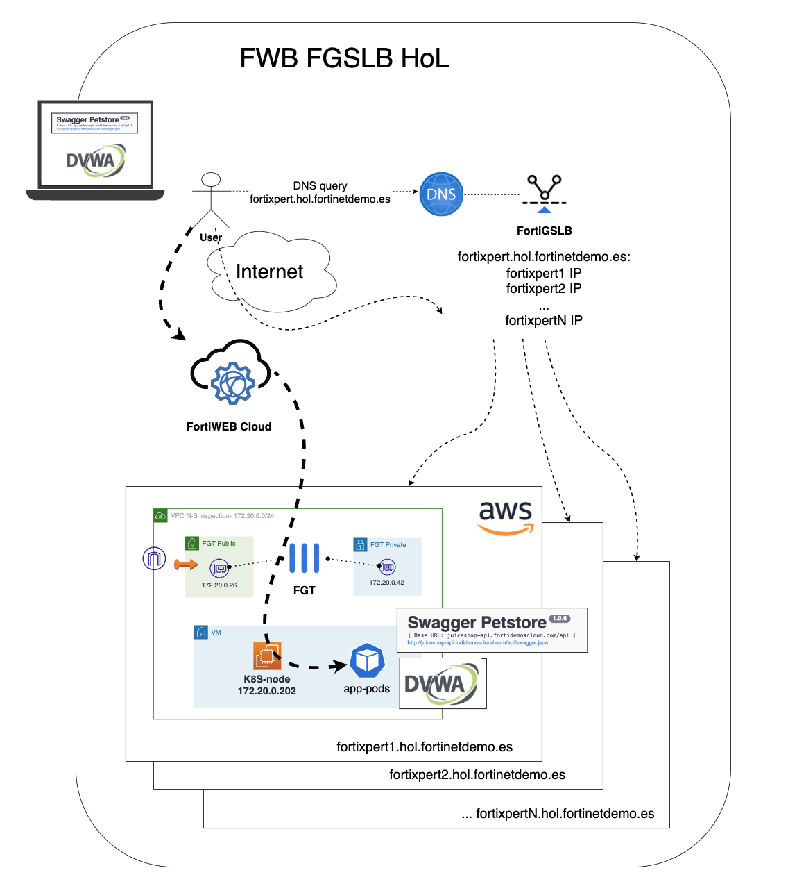

# Hands on Lab FortiWEB Cloud y FortiGSLB
# Protección avanzada de portales WEB y APIs
## Objetivo del laboratorio
El objetivo de este laboratorio es conocer y operar los servicios de Fortinet: FortiWEB Cloud y FortiGSLB. Principalmente nos centraremos en la publicación de 2 aplicaciones de forma segura a través de FortiWEB Cloud, un portal WEB y una API. En el proceso aprenderás a entrenar el modelo de Machine Learning (ML) de la API para conocer el esquema OpenAPI de la misma y a aplicar protección al portal WEB basado reglas TOP10 OWASP y otros ataques sofisticados.

Por último, configuraras nuestro servicio de Global Service Load Balancing (GSLB) mediante DNS, FortiGSLB, para que los usuarios de la aplicación accedan a la misma siempre a su región más cercana. También darás de alta tu aplicación en el servicio DNS, para acceder a la misma de forma sencilla cuando la publiques a través de FortiWEB Cloud. 

El formato del laboratorio consiste en 2 entrenamientos diferenciados y para poder realizarlos encontrarás todos los detalles en la siguiente URL, donde deberás introducir el token facilitado.

http://fwb-fgslb-hol.fortinetdemos.es

## Indice de laboratorios a completar
* T1_fortiweb: protección WEB y protección avanzada de APIs
* **T2_fortigslb**: añadiremos una entrada DNS para vuestras aplicaciones

## Lab T2. Resumen puesta en marcha

En este entrenamiento realizaremos lo siguiente:
- **IMPORTANTE** se debe haber completado con éxito el laboratorio: T1
- Dar de alta nuestra aplicación como server del servicio GSLB.
- Añadir nueevo virtual server al servicio GSLB ya configurado en FortiGSLB.

## Diagram solution




# LAB
## Pasos a seguir:

## 1. Conexión al servicio de FortiGSLB
- En el portal de laboratorio, se ha asigando a cada participante una credencial de FortiCloud.


- Con esas credenciales acceder al servicio SaaS de FortiGSLB en la url [FortiGSLB](https://www.fortigslb.com/#/login)


## 2. Acceso a la organización 
- En la página de bienvenida solicitará acceder a una organización. Hemos creado una para este laboratorio: `HoL`


## 3. Creación de conector y servidor
- Desde FortiGSLB podemos configurar un conector a nuestros Fortigates o FortiADC desplegados en diferentes data centers. 
- El paso previo a dar de alta un nuevo servidor de origen para la resulución DNS, es crear un nuevo conector. 

### 3.1. Nuevo conector
- Desde el menú de la izquierda seleccionaremos `Fabric Connectors`


- Una vez dentro de la sección `Fabric Connectors` crearemos un nuevo conector del tipo Fortigate.


- Los campos necesarios a completar son los siguientes:

  1. Name: `user_id` (Usuario asignado para el laboratorio, ejemplo: fortixpert1)
  2. Data Center: (escoge el correspondiente a tu región)
  3. Address IPv4: (IP de **management** del fortigate, `fgt_url`) 
  4. Port: `8443` (puerto de gestión del fortigate)
  5. Type: `FortiGate`
  6. Sync Control: `Virtual Server`
  7. Auth Tokent: (api_key de tu fortigate, `fgt_api_key`)


- Recuerda darle a `Save`

### 3.2. Nuevo servidor
- Completado el paso 3.1 y tras darle a salvar, nos aparecerá una nueva opción para asociar un nuevo miembre o servidor a este conector.


- Los datos que necesitamos completar son los siguientes:

  1. Name: `user_id` (user_id asignado para el laboratorio)
  2. IP Address: (IP **pública** del fortigate, `fgt_ip`) 


- Recuerda darle a `Save`


## 4. Añadir nuestro servidor al pool students
- Para que el servicio de GSLB incluya al nuevo servidor, debemos añadirlo a la lista de servidores del pool. 
- Seleccionamos en el menú de la izquierda  `Profiles > Pool`


- Dentro de los Pools configurados, seleccionaremos `student-pool` y clicaremos en el botón de editar. 


- Una vez dentro del pool nos iremos a `Create Member` para añadir el nuevo servidor 


- En el desplegable `Virtual Server` buscaremos el servidor que acabamos de crear en pasos anteriores.


- Recuerda darle a `Save`

Con estos pasos, nuestro servidor acaba de añadirse al pool `student-pool`. Este pool, es el que se ha configurado para la resolución de nombres del FQDN: `fortixpert.hol.fortinetdemo.es`, de forma que cuando se realizan consultas DNS a FortiGSLB, resolverá con las IPs del pool con orden dependiente de la region del cliente que realiza las consultas. Esto es así porque hemos configurado un servicio GSLB con balanceo tipo GEO. 

Puedes consultar esta configuraicón desde el menú del izquierda en `GSLB Services`

***NOTA: recuerda no modificar otras configuraciones para no entorpercer el trabajo de tus compañeros***

## 5. Comprobar resolución DNS

- Desde la consola de Cloud9 o desde vuestro PC podeis lanzar una consulta DNS para el FQDN `students.cloudlab.xpersummit-es.com` para comprobar las IPs resueltas. 

- Para lanzar la consulta directamente a FortiGSLB, es posible consultar directamente a nuestra instancia FortiGSLB por su IP anycast. 

```sh
dig fortixpert.hol.fortinetdemo.es

dig @75.2.49.209 fortixpert.hol.fortinetdemo.es
``````


## Laboratorio completado

## Support
This a personal repository with goal of testing and demo Fortinet solutions on the Cloud. No support is provided and must be used by your own responsability. Cloud Providers will charge for this deployments, please take it in count before proceed.

## License
Based on Fortinet repositories with original [License](https://github.com/fortinet/fortigate-terraform-deploy/blob/master/LICENSE) © Fortinet Technologies. All rights reserved.


